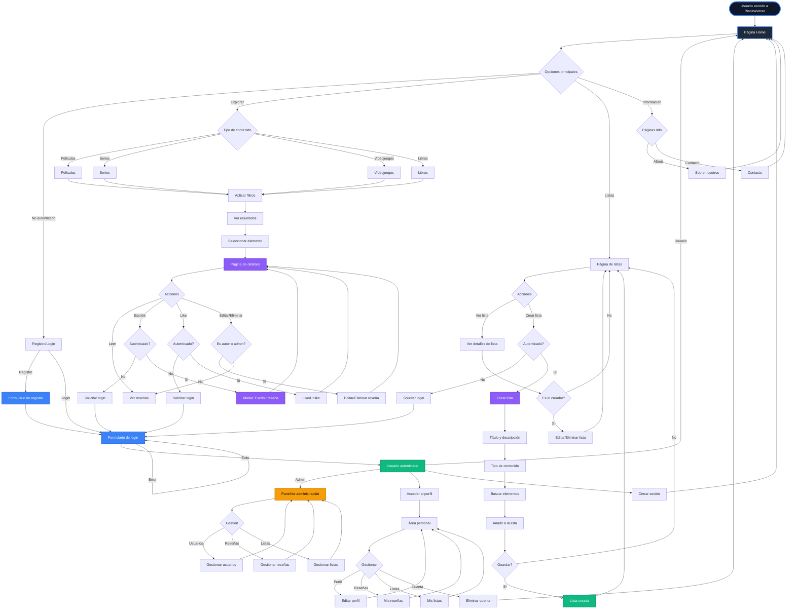
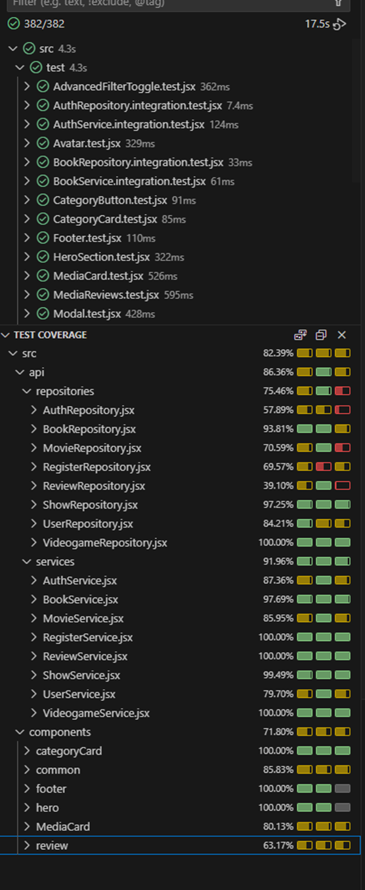

# ReviewVerso 🎬📚🎮📺


> Reviewverso is a platform that brings users a universe of content where they can review any movies, TV series, video games, and books they want and create lists of all their favorite content. All in one place.

[](https://reactjs.org/)
[](https://redux-toolkit.js.org/)
[](https://vitejs.dev/)

---

## 📋 Table of Contents

- [About](#about)
- [Features](#features)
- [User Flow](#user-flow)
- [Tech Stack](#tech-stack)
- [Getting Started](#getting-started)
- [Project Structure](#project-structure)
- [API Integration](#api-integration)
- [Testing](#testing)
- [Contributing](#contributing)

---

## 🎯 About

**ReviewVerso** is a modern, full-featured web application that brings together reviews for multiple entertainment categories in one unified platform. Users can explore content from various sources, write detailed reviews, create custom lists, and interact with a community of entertainment enthusiasts.

### Key Highlights

- 🎬 **Movies & TV Shows** - Powered by TMDB API
- 🎮 **Video Games** - Integrated with IGDB API
- 📚 **Books** - Connected to OpenLibrary API
- ⭐ **Review System** - Write, edit, and like reviews
- 📋 **Custom Lists** - Create and manage personalized collections of any type of content
- 👥 **User Profiles** - Personal area with review and list management
- 🔐 **Authentication** - Secure JWT-based auth system
- 🎨 **Modern UI** - Responsive design with smooth animations

---

## ✨ Features

### 🔍 Content Discovery

- **Advanced Filtering** - Filter content by genre, year, rating, and platform
- **Search Functionality** - Powerful search across all content types
- **Detailed Information** - Comprehensive details pages with images, descriptions, and ratings
- **Mixed Content Feed** - Home page featuring popular items from all categories

### 📝 Review System

- **Write Reviews** - Create detailed reviews with titles, text, and star ratings (1-5)
- **Edit & Delete** - Full CRUD operations for your own reviews
- **Like System** - Like/unlike reviews with persistent state
- **User Avatars** - Personalized profile images for reviewers
- **Authorization Controls** - Edit/delete buttons visible only to authors and admins
- **Modal System** - Elegant confirmation dialogs for all actions

### 📋 List Management

- **Create Custom Lists** - Build collections of movies, series, games, or books
- **Multi-Type Support** - Add different content types to the same list
- **Search & Add** - Search and add items directly while creating lists
- **List Details** - View all items in a list with full information
- **Edit Permissions** - Only list creators can modify their lists

### 👤 User Profile

- **Personal Dashboard** - View all your reviews and lists in one place
- **Profile Customization** - Upload profile pictures and edit personal information
- **Review Management** - Quick access to edit or delete your reviews
- **List Overview** - Manage all your created lists
- **Account Control** - Delete account option with confirmation

### 🛡️ Admin Panel

- **User Management** - View and manage all registered users
- **Review Moderation** - Monitor and moderate all reviews
- **List Oversight** - Manage all user-created lists
- **Full CRUD Access** - Complete control over platform content

### 🎨 User Experience

- **Responsive Design** - Optimized for desktop, tablet, and mobile
- **Dark Theme** - Modern dark color scheme with blue primary accents
- **Smooth Animations** - Transitions and hover effects throughout
- **Loading States** - Visual feedback during async operations
- **Error Handling** - User-friendly error messages via modals
- **Success Feedback** - Confirmation messages for completed actions

---

## 🗺️ User Flow

The application follows a streamlined user journey designed for intuitive navigation:



For a detailed breakdown of all user flows, see the [User Flow Documentation](./docs/user-flow-diagram.md).

---

## 🛠️ Tech Stack

### Frontend Framework
- **React 19.1.1** - UI library with modern hooks
- **React Router DOM 7.9.4** - Client-side routing
- **Vite 7.1.7** - Fast build tool and dev server

### State Management
- **Redux Toolkit 2.9.0** - Centralized state management
- **React Redux 9.2.0** - React bindings for Redux
- **Redux Persist** - State persistence in localStorage

### HTTP Client
- **Axios 1.12.2** - Promise-based HTTP client for API calls

### UI Components & Icons
- **Lucide React 0.545.0** - Beautiful icon library
- **Swiper 12.0.2** - Modern mobile touch slider

### Styling
- **CSS3** - Custom CSS with BEM methodology
- **CSS Variables** - Consistent theming
- **Flexbox & Grid** - Modern layout systems

### Testing
- **Vitest 4.0.3** - Unit testing framework
- **@testing-library/react 16.3.0** - React component testing
- **@testing-library/jest-dom 6.9.1** - Custom matchers for DOM
- **jsdom 27.0.1** - DOM environment for tests
- **@vitest/coverage-v8 4.0.3** - Code coverage reports

### Code Quality
- **ESLint 9.36.0** - Linting and code quality
- **eslint-plugin-react-hooks** - React hooks linting rules

---

## 🚀 Getting Started

### Prerequisites

- **Node.js** (v18 or higher)
- **npm** or **yarn**
- **Git**

### Installation

1. **Clone the repository**
   ```bash
   git clone https://github.com/Ivanlr7/Proyecto-final-F5-frontend.git
   cd Proyecto-final-F5-frontend
   ```

2. **Install dependencies**
   ```bash
   npm install
   ```

3. **Environment Setup**
   
   Create a `.env` file in the root directory:
   ```env
   VITE_API_BASE_URL=http://your-backend-api-url
   VITE_TMDB_API_KEY=your_tmdb_api_key
   VITE_IGDB_CLIENT_ID=your_igdb_client_id
   VITE_IGDB_ACCESS_TOKEN=your_igdb_access_token
   ```

4. **Start the development server**
   ```bash
   npm run dev
   ```

5. **Open your browser**
   
   Navigate to `http://localhost:5173`

### Build for Production

```bash
npm run build
```

The optimized production build will be in the `dist/` folder.

### Preview Production Build

```bash
npm run preview
```

---

## 📁 Project Structure

```
reviewverso-front/
├── docs/                          # Documentation files
│   └── user-flow-diagram.md       # User flow diagrams
├── public/                        # Static assets
├── src/
│   ├── api/                       # API integration layer
│   │   ├── repositories/          # Data access layer
│   │   │   ├── AuthRepository.jsx
│   │   │   ├── MovieRepository.jsx
│   │   │   ├── ShowRepository.jsx
│   │   │   ├── VideogameRepository.jsx
│   │   │   ├── BookRepository.jsx
│   │   │   ├── ReviewRepository.jsx
│   │   │   ├── ListRepository.jsx
│   │   │   └── UserRepository.jsx
│   │   └── services/              # Business logic layer
│   │       ├── AuthService.jsx
│   │       ├── MovieService.jsx
│   │       ├── ShowService.jsx
│   │       ├── VideogameService.jsx
│   │       ├── BookService.jsx
│   │       ├── ReviewService.jsx
│   │       ├── ListService.jsx
│   │       └── UserService.jsx
│   ├── assets/                    # Images, fonts, etc.
│   ├── components/                # Reusable components
│   │   ├── categoryCard/          # Category display cards
│   │   ├── common/                # Shared components
│   │   │   ├── Avatar.jsx
│   │   │   ├── Modal.jsx
│   │   │   ├── Spinner.jsx
│   │   │   ├── EditButton.jsx
│   │   │   └── DeleteButton.jsx
│   │   ├── footer/                # Footer component
│   │   ├── header/                # Header/Navigation
│   │   ├── hero/                  # Hero section
│   │   ├── MediaCard/             # Content cards
│   │   ├── review/                # Review components
│   │   │   ├── MediaReviews.jsx
│   │   │   ├── ReviewModal.jsx
│   │   │   └── ReviewHomeCard.jsx
│   │   ├── SearchBar/             # Search functionality
│   │   └── slider/                # Content sliders
│   ├── pages/                     # Page components
│   │   ├── home/                  # Home page
│   │   ├── movies/                # Movies pages
│   │   │   ├── moviesPage/
│   │   │   └── MovieDetails/
│   │   ├── shows/                 # TV shows pages
│   │   │   ├── showsPage/
│   │   │   └── ShowDetails/
│   │   ├── videogames/            # Video games pages
│   │   │   ├── videogamesPage/
│   │   │   └── videogameDetails/
│   │   ├── books/                 # Books pages
│   │   │   ├── booksPage/
│   │   │   └── bookDetails/
│   │   ├── lists/                 # Lists pages
│   │   │   ├── ListPage.jsx
│   │   │   ├── ListDetailPage.jsx
│   │   │   └── ListCreationPage2.jsx
│   │   ├── user/                  # User profile
│   │   ├── admin/                 # Admin panel
│   │   ├── login/                 # Login page
│   │   ├── register/              # Registration page
│   │   ├── about/                 # About page
│   │   └── contact/               # Contact page
│   ├── routes/                    # Routing configuration
│   │   ├── Routes.jsx
│   │   └── ProtectedAdminRoute.jsx
│   ├── store/                     # Redux store
│   │   ├── index.jsx              # Store configuration
│   │   └── slices/                # Redux slices
│   │       └── authSlice.jsx
│   ├── test/                      # Test files
│   ├── utils/                     # Utility functions
│   ├── App.jsx                    # Main App component
│   ├── main.jsx                   # Entry point
│   └── index.css                  # Global styles
├── .eslintrc.js                   # ESLint configuration
├── vite.config.js                 # Vite configuration
├── vitest.config.js               # Vitest configuration
├── package.json                   # Dependencies
└── README.md                      # This file
```

---

## 🔌 API Integration

### External APIs

#### TMDB (The Movie Database)
- **Movies** - Popular, trending, search, details
- **TV Shows** - Popular, trending, search, details
- **Genres** - Movie and TV show genres
- **Images** - Posters and backdrops

#### IGDB (Internet Game Database)
- **Video Games** - Search, details, cover art
- **Platforms** - Gaming platforms
- **Genres** - Game genres

#### OpenLibrary
- **Books** - Search, details, cover images
- **Authors** - Author information

### Backend API (ReviewVerso)

Base URL: Configured via `VITE_API_BASE_URL`

#### Authentication Endpoints
- `POST /auth/login` - User login
- `POST /auth/logout` - User logout
- `POST /register` - User registration

#### User Endpoints
- `GET /users/me` - Get current user
- `PUT /users/:id` - Update user profile
- `DELETE /users/:id` - Delete user account

#### Review Endpoints
- `GET /reviews` - Get all reviews
- `GET /reviews/content/:type/:id` - Get reviews by content
- `POST /reviews` - Create review
- `PUT /reviews/:id` - Update review
- `DELETE /reviews/:id` - Delete review
- `POST /reviews/:id/like` - Like review
- `DELETE /reviews/:id/like` - Unlike review

#### List Endpoints
- `GET /lists` - Get all lists
- `GET /lists/:id` - Get list details
- `POST /lists` - Create list
- `PUT /lists/:id` - Update list
- `DELETE /lists/:id` - Delete list

---

## 🧪 Testing



---

## 🎨 Design System

### Color Palette

```css
/* Primary Colors */
--primary-color: #3b82f6;          /* Blue */
--primary-color-hover: #2563eb;    /* Darker Blue */
--primary-color-light: rgba(59, 130, 246, 0.1);
--primary-color-border: rgba(59, 130, 246, 0.3);

/* Background Colors */
--bg-dark: #0f172a;                /* Dark Blue */
--bg-darker: #020617;              /* Darker Blue */
--bg-card: #1e293b;                /* Card Background */

/* Text Colors */
--text-primary: #f1f5f9;           /* Light Gray */
--text-secondary: #94a3b8;         /* Gray */

/* Status Colors */
--success: #10b981;                /* Green */
--error: #ef4444;                  /* Red */
--warning: #f59e0b;                /* Orange */
```

### Typography

- **Headings** - Zalando, system-ui
- **Body** - System fonts for optimal performance


## 👨‍💻 Authors

- **Ivanlr7** - [GitHub Profile](https://github.com/Ivanlr7)
-**Frontend** - [https://github.com/Ivanlr7/Proyecto-final-F5-frontend](https://github.com/Ivanlr7/Proyecto-final-F5-frontend)
-**Backend** - [https://github.com/Ivanlr7/Proyecto-final-F5-backend](https://github.com/Ivanlr7/Proyecto-final-F5-backend)


