# User Flow Diagram - ReviewVerso

## Diagrama de Flujo de Usuario Completo

```mermaid
flowchart TD
    Start([Usuario accede a ReviewVerso])
    Home[Página Home]
    
    Start --> Home
    Home --> MainOptions{Opciones principales}
    
    %% Autenticación
    MainOptions -->|No autenticado| AuthFlow[Registro/Login]
    AuthFlow -->|Registro| Register[Formulario de registro]
    AuthFlow -->|Login| Login[Formulario de login]
    Register --> Login
    Login -->|Éxito| Authenticated[Usuario autenticado]
    Login -->|Error| Login
    Authenticated -->|Admin| AdminPanel[Panel de administración]
    Authenticated -->|Usuario| Home
    
    %% Navegación de contenido
    MainOptions -->|Explorar| ContentType{Tipo de contenido}
    ContentType -->|Películas| MoviesPage[Películas]
    ContentType -->|Series| ShowsPage[Series]
    ContentType -->|Videojuegos| GamesPage[Videojuegos]
    ContentType -->|Libros| BooksPage[Libros]
    
    %% Flujo de contenido unificado
    MoviesPage --> ApplyFilters[Aplicar filtros]
    ShowsPage --> ApplyFilters
    GamesPage --> ApplyFilters
    BooksPage --> ApplyFilters
    
    ApplyFilters --> ViewResults[Ver resultados]
    ViewResults --> SelectItem[Seleccionar elemento]
    SelectItem --> DetailsPage[Página de detalles]
    
    %% Sistema de reseñas
    DetailsPage --> ReviewOptions{Acciones}
    ReviewOptions -->|Leer| ViewReviews[Ver reseñas]
    ReviewOptions -->|Escribir| CheckAuth1{Autenticado?}
    ReviewOptions -->|Like| CheckAuth2{Autenticado?}
    ReviewOptions -->|Editar/Eliminar| CheckOwner{Es autor o admin?}
    
    CheckAuth1 -->|No| RequireLogin1[Solicitar login]
    CheckAuth1 -->|Sí| WriteReview[Modal: Escribir reseña]
    CheckAuth2 -->|No| RequireLogin2[Solicitar login]
    CheckAuth2 -->|Sí| ToggleLike[Like/Unlike]
    CheckOwner -->|Sí| ManageReview[Editar/Eliminar reseña]
    CheckOwner -->|No| ViewReviews
    
    WriteReview --> DetailsPage
    ToggleLike --> DetailsPage
    ManageReview --> DetailsPage
    RequireLogin1 --> Login
    RequireLogin2 --> Login
    
    %% Sistema de listas
    MainOptions -->|Listas| ListsPage[Página de listas]
    ListsPage --> ListOptions{Acciones}
    ListOptions -->|Ver lista| ViewList[Ver detalles de lista]
    ListOptions -->|Crear lista| CheckAuth3{Autenticado?}
    
    CheckAuth3 -->|No| RequireLogin3[Solicitar login]
    CheckAuth3 -->|Sí| CreateList[Crear lista]
    RequireLogin3 --> Login
    
    CreateList --> FillListData[Título y descripción]
    FillListData --> ChooseType[Tipo de contenido]
    ChooseType --> SearchItems[Buscar elementos]
    SearchItems --> AddItems[Añadir a la lista]
    AddItems --> SaveList{Guardar?}
    SaveList -->|Sí| ListCreated[Lista creada]
    SaveList -->|No| ListsPage
    ListCreated --> ListsPage
    
    ViewList --> CheckListOwner{Es el creador?}
    CheckListOwner -->|Sí| EditList[Editar/Eliminar lista]
    CheckListOwner -->|No| ListsPage
    EditList --> ListsPage
    
    %% Área personal
    Authenticated --> ProfileAccess[Acceder al perfil]
    ProfileAccess --> ProfilePage[Área personal]
    ProfilePage --> ProfileActions{Gestionar}
    ProfileActions -->|Perfil| EditProfile[Editar perfil]
    ProfileActions -->|Reseñas| MyReviews[Mis reseñas]
    ProfileActions -->|Listas| MyLists[Mis listas]
    ProfileActions -->|Cuenta| DeleteAccount[Eliminar cuenta]
    
    EditProfile --> ProfilePage
    MyReviews --> ProfilePage
    MyLists --> ProfilePage
    DeleteAccount --> Home
    
    %% Panel admin
    AdminPanel --> AdminActions{Gestión}
    AdminActions -->|Usuarios| ManageUsers[Gestionar usuarios]
    AdminActions -->|Reseñas| ManageReviews[Gestionar reseñas]
    AdminActions -->|Listas| ManageLists[Gestionar listas]
    ManageUsers --> AdminPanel
    ManageReviews --> AdminPanel
    ManageLists --> AdminPanel
    
    %% Información
    MainOptions -->|Información| InfoPages{Páginas info}
    InfoPages -->|About| AboutPage[Sobre nosotros]
    InfoPages -->|Contacto| ContactPage[Contacto]
    AboutPage --> Home
    ContactPage --> Home
    
    %% Cerrar sesión
    Authenticated --> Logout[Cerrar sesión]
    Logout --> Home
    
    %% Estilos
    style Start fill:#0f172a,stroke:#3b82f6,color:#fff,stroke-width:3px
    style Home fill:#1e293b,stroke:#3b82f6,color:#fff,stroke-width:2px
    style Login fill:#3b82f6,stroke:#2563eb,color:#fff,stroke-width:2px
    style Register fill:#3b82f6,stroke:#2563eb,color:#fff,stroke-width:2px
    style Authenticated fill:#10b981,stroke:#059669,color:#fff,stroke-width:2px
    style AdminPanel fill:#f59e0b,stroke:#d97706,color:#000,stroke-width:2px
    style DetailsPage fill:#8b5cf6,stroke:#7c3aed,color:#fff,stroke-width:2px
    style WriteReview fill:#8b5cf6,stroke:#7c3aed,color:#fff,stroke-width:2px
    style CreateList fill:#8b5cf6,stroke:#7c3aed,color:#fff,stroke-width:2px
    style ListCreated fill:#10b981,stroke:#059669,color:#fff,stroke-width:2px
```

## Main Flow Descriptions

### 1. **Authentication Flow**
- **Registration**: Form with validation → Account creation → Redirect to login
- **Login**: Credentials → Authentication → JWT token → Redux store
- **Logout**: Remove token → Clear state → Redirect to home

### 2. **Content Navigation Flow**
- User selects content type (Movies/Series/Video Games/Books)
- Apply advanced filters (genre, year, rating, platform)
- View filtered results
- Select item → Details page

### 3. **Review Flow**
- **Reading**: Any user can view reviews
- **Writing**: Requires authentication → Modal with form → Validation → Publication
- **Editing**: Only author or admin → Pre-filled modal → Update
- **Deletion**: Only author or admin → Confirmation modal → Deletion
- **Likes**: Requires authentication → Toggle like/unlike → Counter update (localStorage persistence)

### 4. **List Flow**
- **Creation**: 
  - Requires authentication
  - Enter title and description
  - Select content type
  - Search and add items
  - Save list
- **Viewing**: Any user can view public lists
- **Editing/Deletion**: Only the creator can modify

### 5. **Personal Area Flow**
- View complete profile
- Edit personal information and profile picture
- View my published reviews
- View my created lists
- Option to delete account (with confirmation)

### 6. **Administrative Flow** (Admin role users only)
- Access to administration panel
- Complete user management
- Complete review management
- Complete list management
- All actions require confirmation via modal

## Authentication Control Points

### Require Authentication:
- ✅ Write reviews
- ✅ Like reviews
- ✅ Create lists
- ✅ Edit profile
- ✅ Delete account

### Require Specific Authorization:
- 🔐 Edit review (author or admin)
- 🔐 Delete review (author or admin)
- 🔐 Edit list (creator)
- 🔐 Delete list (creator)
- 🔐 Access admin panel (admin role)

## Global States (Redux)

### Auth Slice:
- `isAuthenticated`: Boolean
- `user`: User object
- `token`: JWT token
- `role`: Array of roles (user, admin)
- `loading`: Loading state
- `error`: Error messages
- `isInitialized`: Initialization state

### Persistence:
- Token and user data in localStorage
- Review likes in localStorage (per user)
- Token validation on application load

## Modal Components

### Modal Types:
- **alert**: Informative message with one button
- **confirm**: Confirmation with two buttons (cancel/confirm)
- **success**: Success message
- **error**: Error message
- **info**: Additional information

### Uses:
- Deletion confirmations
- Authentication required alerts
- Success/error messages in operations
- Edit forms (ReviewModal)

## Navigation

### Public Routes:
- `/` - Home
- `/about` - About us
- `/contact` - Contact
- `/peliculas` - Movies
- `/peliculas/:id` - Movie details
- `/series` - TV Series
- `/series/:id` - Series details
- `/videojuegos` - Video Games
- `/videojuegos/:id` - Video game details
- `/libros` - Books
- `/libros/:id` - Book details
- `/listas` - Lists
- `/listas/:id` - List details
- `/login` - Sign in
- `/register` - Sign up

### Protected Routes (Require Authentication):
- `/me` - Personal area
- `/listas/crear` - Create list

### Administrative Routes (Require Admin Role):
- `/admin` - Administration panel

## API Integration

### External APIs:
- **TMDB**: Movies and TV series
- **IGDB**: Video games
- **OpenLibrary**: Books

### Backend API (ReviewVerso):
- Authentication (login, logout, registration)
- User management
- Review management (CRUD)
- List management (CRUD)
- Like system

